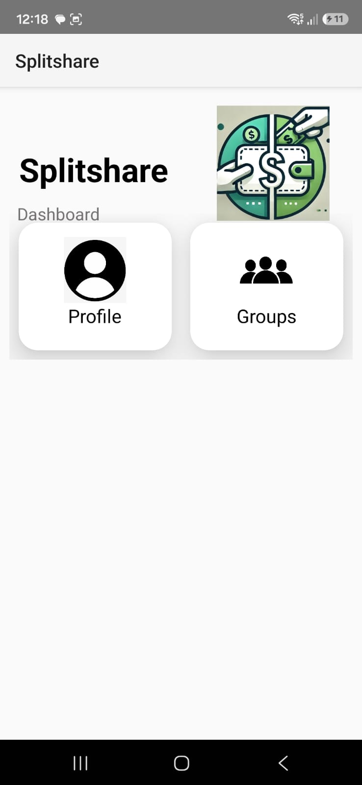
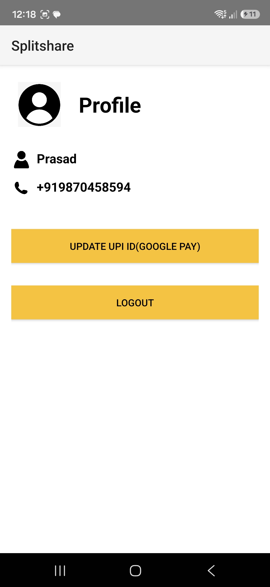
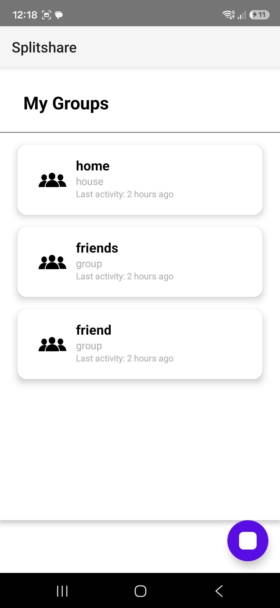
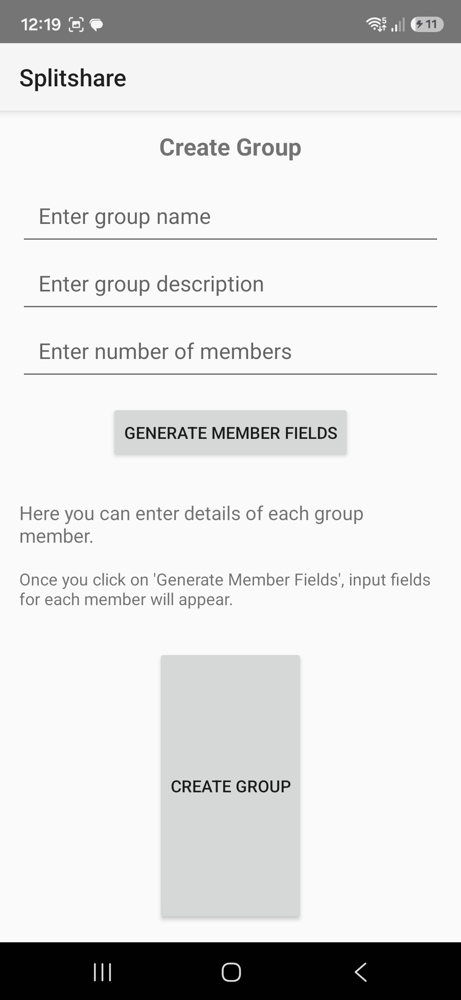
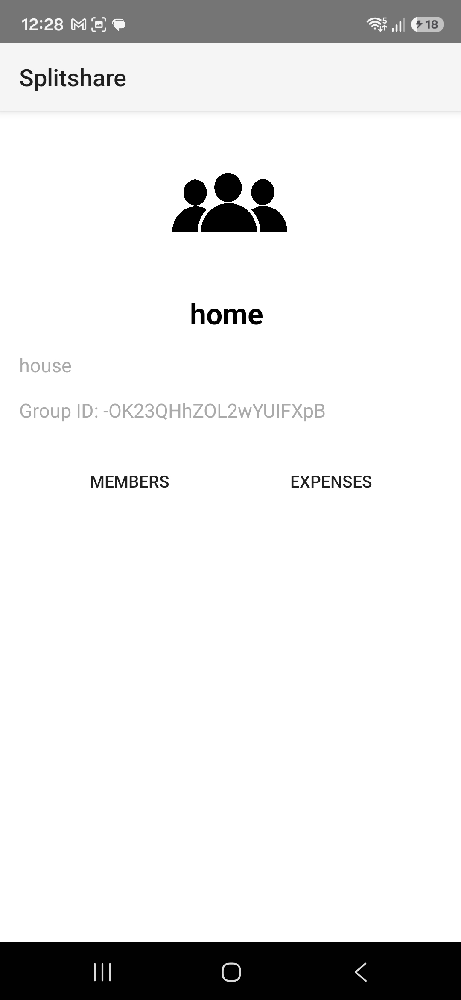
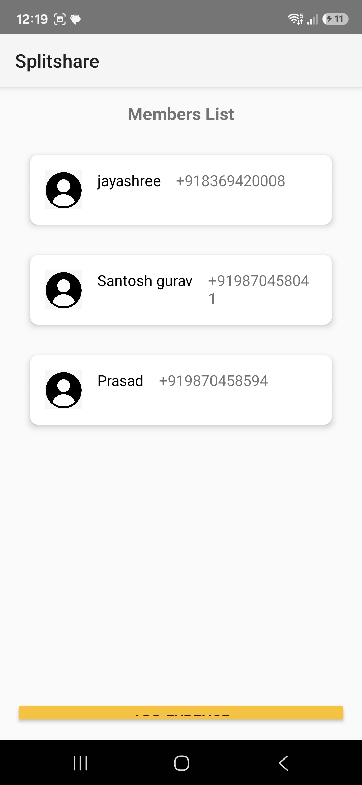
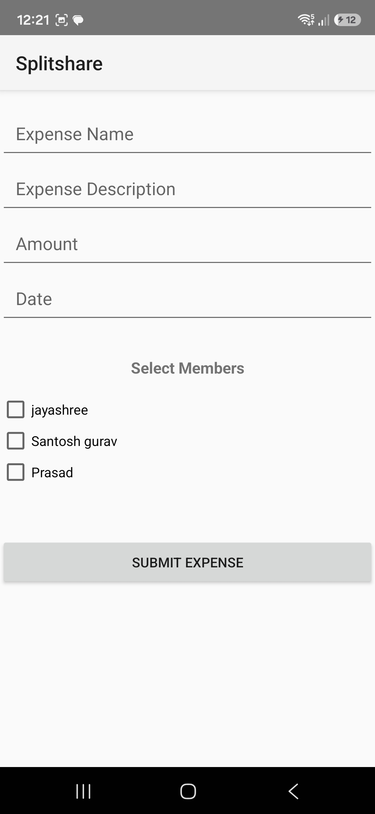
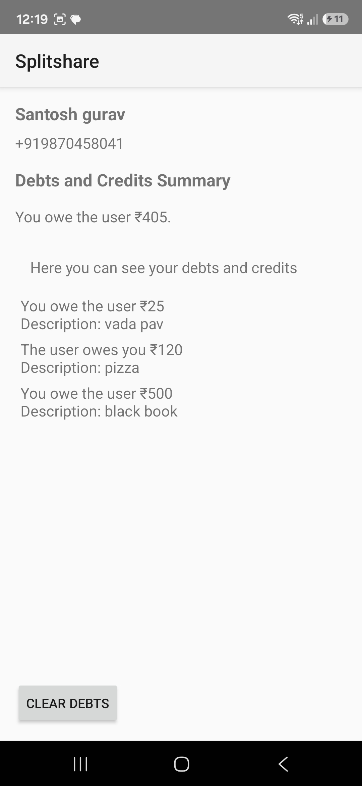
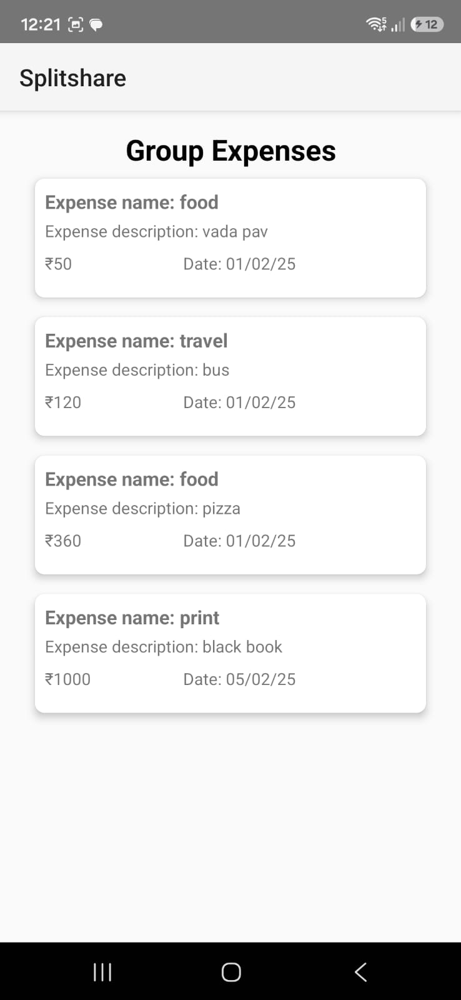

# Expense Splitter App

Android application for splitting expenses among friends and groups.

## Features
- OTP Login
- Firebase Authentication
- Expense Tracking
- Group Management
- Email Notifications
- Payment Integration

## Tech Stack
- Java
- XML
- Firebase
- Android Studio

## Future Improvements
- UPI Integration
- Dark Mode
- Analytics Dashboard

  <table>
  <tr>
    <td></td>
    <td></td>
    <td></td>
  </tr>
  <tr>
    <td></td>
    <td></td>
    <td></td>
  </tr>
  <tr>
    <td></td>
    <td></td>
    <td></td>
  </tr>
  <tr>
    <td></td>
    <td></td>
    <td></td>
  </tr>
</table>

## Author
Prasad Gurav
